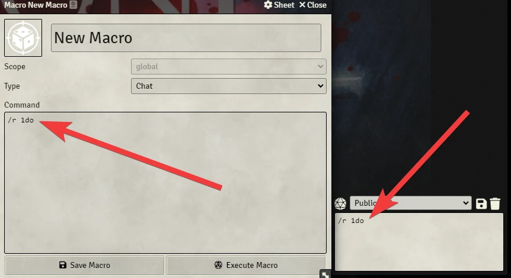

# Omniscient Die

<p align="center">
  
</p>

# About
This module adds a die that can be invoked with a scroll expression: /r 1dr.

Some GMs like to resolve situations very quickly with a roll.

**Example:** A player asks if there is a big tree near where he is. The GM says he's going to roll a dice and if it's even the answer is yes, and if it's odd the answer is no.

This module intends to do the same thing in an expanded form.

**Results**
- Yes, and... = Yes and has a magnified effect.
- Yes = Expected from yes.
- Yes, but = This can be a partial yes. This can be a yes with a twist or complication.
- No, but = This can be a partial no. This can be a no with a twist or complication.
- No = Expected from no.
- No, and... = No, and has a magnified effect.

Player: "Is the party interrupted by a patrol of guards?"
- YEA! - Master: "Players come face to face with a patrol guard and still led by the ruthless captain!"
- Yes - Master: "A guard patrol has found you."
- Yes, But - Master: "A group of guards moves to where you are, but they still haven't noticed you."
- No, But - Master: "No, but a noisy punk is approaching you."
- No - Master: "No."
- NO! - Master: "No and the guard patrol was called to solve a situation far away. You don't have to worry about them."

# Sobre

[

Esse módulo adiciona um dado que pode ser invocado com uma expressão de rolagem: `/r 1dr`.

Alguns mestres gostam de resolver situações de forma bem rápida com uma rolagem. 

**Exemplo:** Um jogador pergunta se existe uma grande árvore próximo ao lugar em que ele se encontra. O mestre diz que vai rolar um dado e se for par a resposta é sim, e se for ímpar a resposta é não. 

Esse módulo pretende fazer a mesma coisa de forma expandida.

**Resultados**
- Sim, e... = Sim e tem um efeito ampliado.
- Sim = O esperado do sim.
- Sim, mas = Um sim parcial ou um sim com uma complicação.
- Não, mas = Um não parcial ou um não com uma complicação.
- Não = O esperado do não.
- Não, e... = Não e tem um efeito ampliado.

Jogador: "O grupo é interrompido por uma patrulha de guardas?"
- Sim, E... - Mestre: "Os jogadores dão de cara com uma patrulha de guarda e ainda liderada pelo implacável capitão!"
- Sim - Mestre: "Uma patrulha de guarda achou vocês."
- Sim, Mas - Mestre: "Um grupo de guardas se move para onde vocês estão, mas eles ainda não notaram vocês."
- Não, Mas - Mestre: "Não, mas um pinguço barulhento se aproxima de vocês."
- Não - Mestre: "Não."
- Não, e... - Mestre: "Não e a patrulha de guardas foi chamada para resolver uma situação longe daí. Vocês não precisam se preocupar com eles."

# Instalação / Installation
Você pode instalar esse com esse link: **https://raw.githubusercontent.com/brunocalado/omniscient-die/main/module.json**

# Instruções / Instructions

## Português
Siga as instruções da imagem. Depois, use a expressão de rolagem `/r 1dr` para rolar. O módulo tem um atalho de teclado, cheque controles no Foundry VTT.
<p align="center">
  
</p>

Você pode digitar no chat `/r 1dr` ou criar uma expressão de rolagem.
<p align="center">
  
</p>

## English
Follow the image steps. After that use `/r 1dr` to roll. The module also has a keybinding, check controls.

<p align="center">
  
</p>

You can type `/r 1dr` on the chat or create a macro.
<p align="center">
  
</p>

# Dice so Nice

## Português
Você pode colocar sons ou animações para executar quando o dado for rolado. Para fazer isso use a interface de configurações do Dice so Nice.

## English
You can add a sound or an animation to the dice. Just go to Dice so Nice settings to do that.

<p align="center">
  
</p>

# Localization
If you want to translate this module [DOWNLOAD THIS FILE](https://raw.githubusercontent.com/brunocalado/omniscient-die/main/lang/en.json) and translate it. After that open an issue sharing your translation. 

You also need to share with me the default name convention for your language. This is very easy to get. 
- Find a system or module which is translated to your language. 
- Open the **module.json** or **system.json** file.
- You should find something like the code above. It's under **languages**. Share with me **lang, name and path** for your language.
```json
{
  "lang": "en",
  "name": "English",
  "path": "lang/en.json"
},
{
    "lang": "fr",
    "name": "Français",
    "path": "lang/fr.json"
}  
```
- You also need to modify the images. You can download templates [CLICKING HERE](https://github.com/brunocalado/omniscient-die/raw/main/docs/templates-for-omniscient-die.7z). You can use Photoshop or [GIMP](https://www.gimp.org/) to work, you just need to send me the six PNG files.

# License

- [CODE LICENSE](https://github.com/brunocalado/omniscient-die/blob/main/LICENSE)
- [IMAGES LICENSE](https://creativecommons.org/licenses/by-sa/4.0/)
- This module was made using [this](https://lowfantasygaming.com/2017/04/29/yes-no-but-dice/) as reference. 

# Assets

- The images are made with [GIMP](https://www.gimp.org/) and Photoshop.
- The designer is [Matheus Moreno Mota](https://www.instagram.com/matheus_mesmo/)

<p align="center">
  
</p>